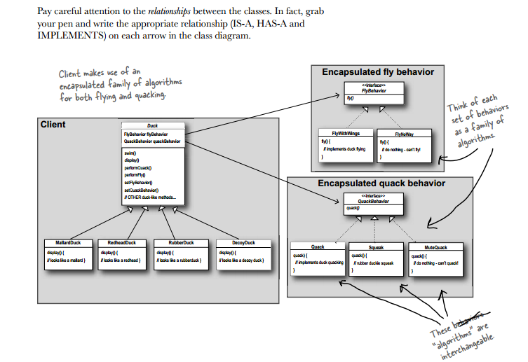
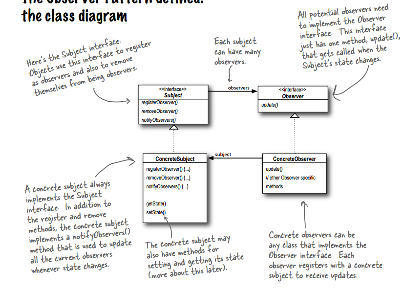

# design-patterns-in-c++
A study on desgin patterns in c++.
## Case study I (Duck behaviour) :Strategy pattern
The perfect world where a Duck super class inheriting for all subclasses is not good enough anymore if a flying/quaking behaviour is need to be added for selected duck-subclasses.
* Cant inherit fly/quack from Duck superclass to subclasses.
    (then we'll need to override those in case of wodden duck).

* Cant make those as Flyable/Quackable interface(class with only pure virtual methods) and let each subclass implement them.
    (Code duplicate! if a slight change is required, then all implementations needs to be modified.(destroys code reusability)).

##### solution
>[Design I] :take the parts that vary an encapsulate them, so that later you can alter or extend the parts that vary without affecting those that don't**

All patterns provides a way to let some part of a system vary independently of all other parts.

note:

>[Design II] :Program to an interface/supertype not an implementation.

we'll create interface for each behavior and implement differently for each interface(as seperate classes) so that at runtime Duck class achieve polymorphism and switch to different implementation of a single interface(behaviour).

now each subclass will instantiate the interface objects with appropriate flying/quacking behaviour implementations 

>[Design III] :Favour composition over inheritance (HAS-A over IS-A)
Instead of inheriting their behaviour the ducks gets their behaviour by being composed with the right behaviour object.

The Strategy pattern defines a family of algorithms, encapsulates each one, and makes them interchangable. Strategy lets the algorithm vary independently from clients that use it.

## Case study II (Weather Object) :Observer pattern

Publisher(Subjet) + subscriber(Observers) = Observer pattern
Subscriber subscribes/registers with Publisher

The Observer Pattern defines a one-to-many dependency between objects so that when one object changes state, all of its dependents are
notified and updated automatically.

    In Observer pattern the objects (Subject&Observers) are loosely coupled
When two objects are loosely coupled, they can interact, but have very little knowledge of each other.

### Loosely coupled
* The only thing the subject knows about an observer is that it
  implements a certain interface
* We can add new observers any time we want (Subject will only maintain a list of objects implementing Observer interface)
* We never need to modify the subject to add new types of observers (As long as the object implements Observer interface)
* We can reuse subjects or observers independently of each other (Changes to the subject or an observer will not affect the other)

>[Design IV] :Strive for loosely coupled design between the objects that interact.

eg : Class A having pointer to concrete implementation of Class B : Tightly coupled
     Class A having pointer to interface of Class B (i.e Class B_interface), So that B can be replaced
     with C (if C implements B_interface) in Class A w/o changing Class A. : Loosely coupled

 Loosely coupled designs allow us to build flexible OO systems that can handle change because they
 minimize the interdependency between objects.

 PULL & PUSH
 The Subject/Publisher can make use of pull method or push method to let observer access the state.
 * push method is same as broadcasting to the listeners on change of state along with the properties(object whose state changed).
 * exposing getter functions for observers to access the state(anytime or when a notification comes) is pull method.

