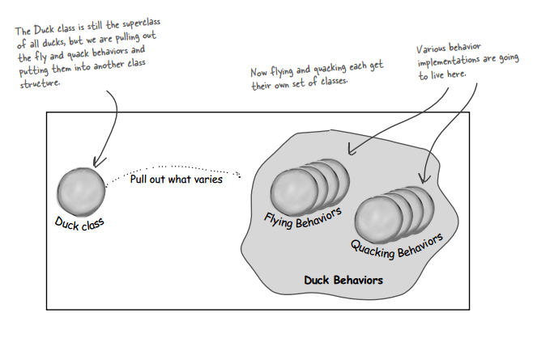
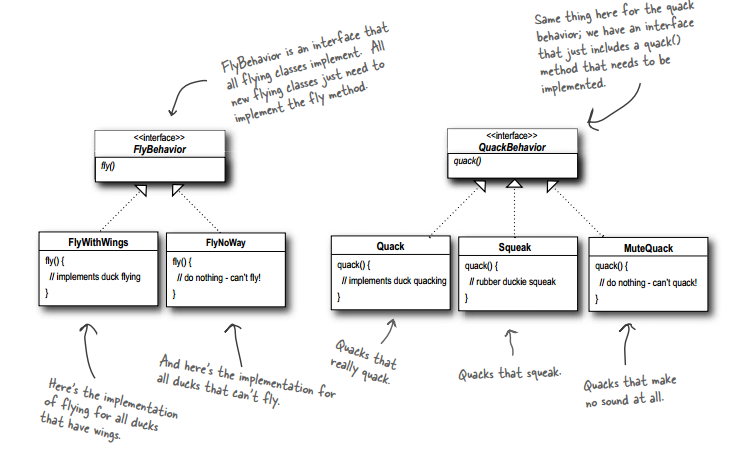
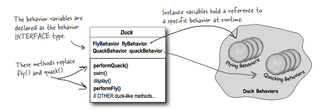

# design-patterns-in-c++
A study on desgin patterns in c++.
## Case study I (Duck behaviour)
The perfect world where a Duck super class inheriting for all subclasses is not good enough anymore if a flying/quaking behaviour is need to be added for selected duck-subclasses.
* Cant inherit fly/quack from Duck superclass to subclasses.
    (then we'll need to override those in case of wodden duck).

* Cant make those as Flyable/Quackable interface(class with only pure virtual methods) and let each subclass implement them.
    (Code duplicate! if a slight change is required, then all implementations needs to be modified.(destroys code reusability)).

##### solution

**> take the parts that vary an encapsulate them, so that later you can alter or extend the parts that vary without affecting those that don't**

All patterns provides a way to let some part of a system vary independently of all other parts.

note:
Program to an interface/supertype not an implementation.
we'll create interface for each behavior and implement differently for each interface(as seperate classes) so that at runtime Duck class achieve polymorphism and switch to different implementation of a single interface(behaviour).

now each subclass will instantiate the interface objects with appropriate flying/quacking behaviour implementations 

